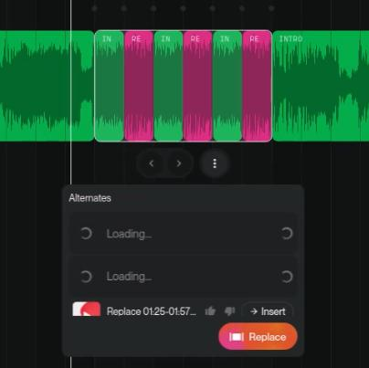

# 🎵 Seamless Audio Looping & Preservation Protocol

This protocol is designed to guide Generative AI tools in correcting audio transitions without altering the original composition. It focuses on technical audio engineering rather than creative remixing.

### 🛠 The Prompt

> "Maintain the exact instrumental arrangement and composition of the source audio without introducing any new elements. Focus exclusively on the loop transition: seamlessly bridge the loop point by allowing the harmonic decay and instrumental tails of the final measure to bleed naturally into the starting beat. Ensure the rhythmic synchronization remains perfect, eliminating any audible jumps or abrupt silence. Create a fluid, infinite cycle where the beginning and end are indistinguishable."

---

### 🔍 Detailed Breakdown

* **Integrity Anchor & Composition Lock**
* *"Maintain the exact instrumental arrangement and composition..."*
* This opening statement serves as a foundational anchor. It instructs the AI that the musical structure is immutable. By locking the composition, you prevent the model from "hallucinating" new melodies or changing the core identity of the track. The focus is strictly restricted to the audio stitching process.

* **Zero-Addition Constraint**
* *"Without introducing any new elements"*
* This reinforces the preservation of the source material. It ensures that the AI does not attempt to "improve" or remix the song from scratch. Only existing frequencies and textures should be adjusted to facilitate the loop.

* **Technical Transition Engineering**
* *"Harmonic decay and instrumental tails... bleed naturally into the starting beat"*
* Instead of a hard cut, this command forces the AI to calculate the natural fade-out of instruments (like reverb and synth releases) and overlay them onto the beginning of the loop. This mimics how a real musician would play a repeating phrase, ensuring the "energy" of the ending carries over.

* **Rhythmic Synchronization & Artifact Removal**
* *"Eliminating any audible jumps or abrupt silence"*
* This targets the most common issues loops: "clicks," "pops," or the dreaded half-second of silence. It demands a perfect mathematical alignment of the BPM (Beats Per Minute) at the loop point.

